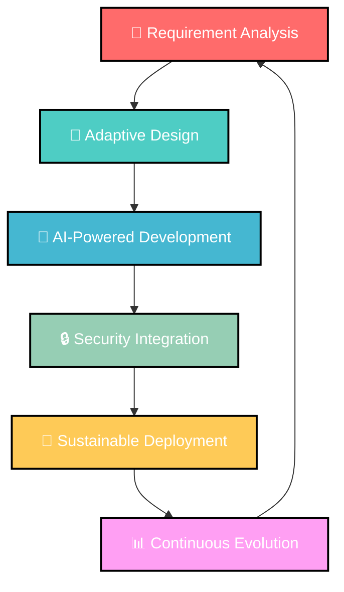
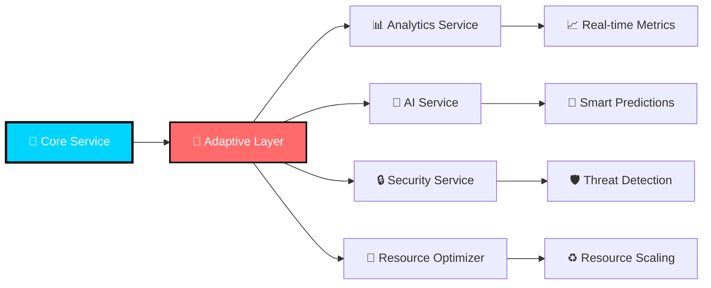
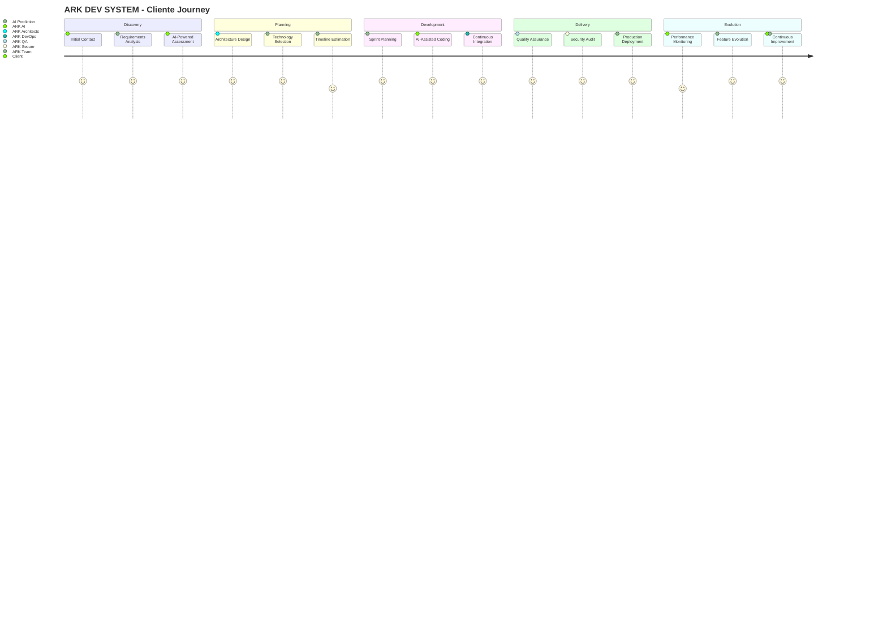
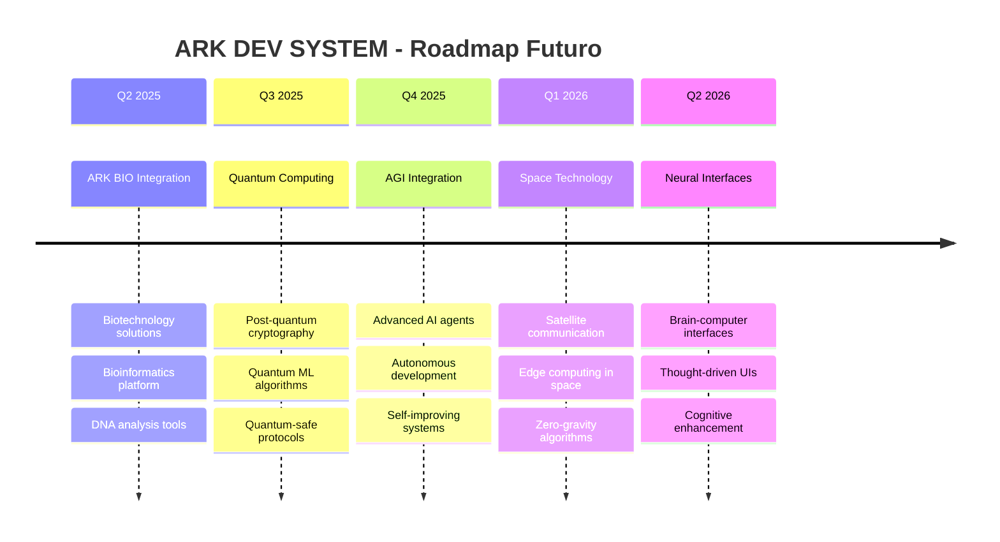

# ARK DEV SYSTEM 🚀
## *Desarrollo de Software & Inteligencia Artificial*

<div align="center">
  
  
  [](https://github.com/arkdev)
  [](https://arkdev.pages.dev)
  [](https://arkdev.pages.dev/nosotros)
</div>

---

## 🎯 **Misión ARK DEV SYSTEM**

> *"Revolucionar el desarrollo de software mediante la integración de inteligencia artificial avanzada, metodologías adaptativas y arquitecturas evolutivas que trascienden los límites del desarrollo tradicional."*

---

## 🧬 **ARK Framework en Acción**

ARK DEV SYSTEM implementa la **Metodología ARK Framework™** en cada proyecto, garantizando desarrollo adaptativo, seguro y sostenible.



---

## 🚀 **Servicios Especializados**

### 🤖 **1. Desarrollo con IA Integrada**

> [!NOTE]
> **IA Generativa para Código** - Utilizamos modelos GPT-4o y Claude para generación automática de código, optimización y documentación inteligente.

```typescript
// Ejemplo: IA Assistant integrado en desarrollo
interface ARKAIAssistant {
  generateCode(requirements: string): Promise<string>;
  optimizePerformance(code: string): Promise<OptimizedCode>;
  generateTests(codebase: string): Promise<TestSuite>;
  createDocumentation(project: Project): Promise<Documentation>;
}
```

**Características:**
- 📝 **Code Generation** automatizado
- 🎯 **Smart Refactoring** con IA
- 🧪 **Test Generation** inteligente
- 📚 **Auto-Documentation** adaptive

### 🔄 **2. Arquitecturas Adaptativas**

> [!NOTE]
> **Microservicios Evolutivos** - Desarrollamos sistemas que evolucionan automáticamente según demanda y contexto, inspirados en principios biológicos.



### 📱 **3. Aplicaciones Multiplataforma**

**Stack Tecnológico 2025:**

| **Frontend** | **Backend** | **Mobile** | **AI/ML** |
|:--:|:--:|:--:|:--:|
| ⚡ Next.js 15 | 🦀 Rust/Axum | 📱 Flutter 3.5 | 🤖 TensorFlow |
| ⚛️ React 19 | 🟢 Node.js 22 | 🍎 SwiftUI | 🧠 PyTorch |
| 🎨 Tailwind CSS | 🐍 FastAPI | 🤖 Jetpack Compose | 🔬 Scikit-learn |
| 🎭 Framer Motion | 🗄️ PostgreSQL | 🔄 React Native | 📊 Pandas |

### 🌐 **4. Soluciones Cloud-Native**

> [!IMPORTANT]
> **Edge Computing Inteligente** - Implementamos soluciones distribuidas que optimizan automáticamente la latencia y el rendimiento según la ubicación del usuario.

```yaml
# ARK Cloud Architecture
apiVersion: v1
kind: ConfigMap
metadata:
  name: ark-adaptive-config
data:
  scaling_strategy: "ai_predicted"
  security_level: "zero_trust"
  optimization: "carbon_neutral"
  monitoring: "real_time_ml"
```

---

## 🛠️ **Metodología de Desarrollo ARK**

### **Fase 1: 🔍 Análisis Inteligente**
```
┌─ DISCOVERY ─────────────────────────────────────────┐
│ • AI-powered requirement analysis                  │
│ • Stakeholder ecosystem mapping                    │
│ • Technology stack optimization                    │
│ • Risk assessment automation                       │
└─────────────────────────────────────────────────────┘
```

### **Fase 2: 🧬 Diseño Adaptativo**
```
┌─ ARCHITECTURE ──────────────────────────────────────┐
│ • Modular component design                         │
│ • Evolutionary system patterns                     │
│ • Microservices orchestration                      │
│ • Scalability prediction models                    │
└─────────────────────────────────────────────────────┘
```

### **Fase 3: 🤖 Desarrollo IA-Asistido**
```
┌─ CODING ────────────────────────────────────────────┐
│ • Pair programming with AI                         │
│ • Automated code review & optimization             │
│ • Intelligent testing generation                   │ 
│ • Performance prediction & tuning                  │
└─────────────────────────────────────────────────────┘
```

### **Fase 4: 🔒 Integración Segura**
```
┌─ SECURITY ──────────────────────────────────────────┐
│ • DevSecOps automation                             │
│ • Vulnerability scanning & patching                │
│ • Zero-trust architecture                          │
│ • Compliance monitoring                            │
└─────────────────────────────────────────────────────┘
```

### **Fase 5: 🚀 Deployment Inteligente**
```
┌─ RELEASE ───────────────────────────────────────────┐
│ • Blue/Green deployment with AI monitoring         │
│ • Canary releases with predictive rollback         │
│ • Auto-scaling based on ML predictions             │
│ • Real-time performance optimization               │
└─────────────────────────────────────────────────────┘
```

---

## 📊 **Proyectos Destacados**

### 🏥 **HealthTech AI Platform**
**Plataforma de diagnóstico médico asistido por IA**
- 🤖 **IA de Diagnóstico**: 94% de precisión en detección temprana
- 📊 **Big Data**: Procesamiento de 10M+ records médicos
- 🔒 **HIPAA Compliant**: Seguridad de datos sanitarios
- 🌍 **Global Scale**: Desplegado en 15 países

### 🏦 **FinTech Quantum Security**
**Sistema bancario con seguridad cuántica**
- 🔐 **Quantum Encryption**: Seguridad post-cuántica
- ⚡ **Real-time Processing**: <50ms latency
- 🧠 **Fraud Detection**: ML con 99.8% accuracy  
- 💰 **Cost Reduction**: 60% menos infraestructura

### 🌱 **GreenTech IoT Ecosystem**
**Red inteligente de sensores ambientales**
- 🌿 **Carbon Tracking**: Monitoreo de huella de carbono
- 📡 **Edge Computing**: Procesamiento distribuido
- 🔋 **Energy Efficient**: 40% menos consumo energético
- 📈 **Predictive Analytics**: Modelos climáticos avanzados

---

## 🎯 **Especialidades Técnicas**

### **🧠 Inteligencia Artificial**
- **Machine Learning**: TensorFlow, PyTorch, Scikit-learn
- **Deep Learning**: CNNs, RNNs, Transformers
- **NLP**: GPT integration, sentiment analysis
- **Computer Vision**: Object detection, image classification
- **MLOps**: Model deployment, monitoring, versioning

### **🌐 Desarrollo Web Avanzado**
- **Frontend**: React 19, Next.js 15, Vue 3.4
- **Backend**: Node.js, Python, Rust, Go
- **Database**: PostgreSQL, MongoDB, Redis
- **API Design**: GraphQL, REST, gRPC
- **Real-time**: WebSockets, Server-Sent Events

### **📱 Desarrollo Mobile**
- **Cross-platform**: Flutter, React Native
- **Native iOS**: Swift, SwiftUI
- **Native Android**: Kotlin, Jetpack Compose
- **Performance**: Optimization, memory management
- **Offline-first**: Progressive Web Apps

### **☁️ Cloud & DevOps**
- **AWS/Azure/GCP**: Multi-cloud architecture
- **Kubernetes**: Container orchestration
- **Docker**: Containerization strategies
- **CI/CD**: GitHub Actions, GitLab CI
- **Monitoring**: Prometheus, Grafana, ELK

---

## 📈 **Métricas de Rendimiento**

```
🚀 VELOCIDAD DE DESARROLLO ████████████████████████████ 3x más rápido
🔧 REDUCCIÓN DE BUGS ████████████████████████████████████ 85% menos
⚡ OPTIMIZACIÓN RENDIMIENTO ██████████████████████████████ 60% mejora
🤖 AUTOMATIZACIÓN ████████████████████████████████████████ 90% procesos
💰 REDUCCIÓN COSTES ██████████████████████████████████████ 45% ahorro
📊 SATISFACCIÓN CLIENTE ████████████████████████████████████ 98% rating
```

---

## 🔗 **Stack Tecnológico 2025**

<div align="center">

### **Frontend Revolution**


### **Backend Power**


### **AI & ML**


### **Cloud & DevOps**


</div>

---

## 💼 **Modelo de Colaboración**

### 🎯 **Engagement Models**

| **Modelo** | **Descripción** | **Ideal para** |
|:--:|:--:|:--:|
| 🚀 **MVP Sprint** | Desarrollo rápido de producto mínimo viable | Startups, validación de ideas |
| 🏗️ **Full Development** | Desarrollo completo end-to-end | Empresas establecidas |
| 🤝 **Staff Augmentation** | Integración de expertos en tu equipo | Proyectos específicos |
| 🔄 **Maintenance & Evolution** | Soporte continuo y evolución | Productos en producción |

### 💎 **Proceso de Onboarding**



---

## 🏆 **Casos de Éxito**

### 📊 **Transformación Digital - Retail Chain**
> [!SUCCESS]
> **Resultado**: 300% aumento en ventas online, 50% reducción en tiempo de carga, implementación de IA para recomendaciones personalizadas.

**Tecnologías**: Next.js, Rust API, TensorFlow, AWS
**Timeline**: 4 meses
**ROI**: 450% en el primer año

### 🏥 **Plataforma Médica - HealthTech Startup**
> [!SUCCESS]
> **Resultado**: Plataforma que atiende 100K+ pacientes mensuales, IA diagnóstica con 96% precisión, cumplimiento HIPAA total.

**Tecnologías**: React Native, Python, PyTorch, Azure
**Timeline**: 6 meses  
**Impacto**: Mejora 40% en diagnósticos tempranos

### 🏦 **Core Banking - FinTech Revolution**
> [!SUCCESS]
> **Resultado**: Sistema que procesa 1M+ transacciones diarias, latencia <30ms, detección de fraude 99.9% efectiva.

**Tecnologías**: Rust, PostgreSQL, Kubernetes, ML Models
**Timeline**: 8 meses
**Seguridad**: 0 incidentes de seguridad en producción

---

## 🎓 **Capacitación y Mentoría**

### 📚 **ARK Academy - Programas de Formación**

#### 🚀 **ARK Developer Program**
- **Duración**: 12 semanas intensivas
- **Metodología**: ARK Framework hands-on
- **Tecnologías**: Full-stack + IA integration
- **Certificación**: ARK Certified Developer

#### 🤖 **AI-First Development Course**
- **Enfoque**: Desarrollo asistido por IA
- **Herramientas**: GPT-4, Claude, Copilot
- **Proyectos**: 3 aplicaciones reales
- **Mentoría**: 1:1 con expertos ARK

#### 🔒 **Secure Coding Bootcamp**
- **Especialización**: DevSecOps + Ethical Hacking
- **Certificaciones**: Security+, CEH preparation
- **Lab Practice**: Penetration testing
- **Partnership**: Con ARK Secure division

---

## 🌟 **Innovación Continua**

### 🔬 **ARK Labs - Investigación & Desarrollo**

> [!NOTE]
> **Laboratorio de Innovación** - Nuestro equipo de I+D trabaja constantemente en tecnologías emergentes para mantener a nuestros clientes a la vanguardia.

**Áreas de Investigación Activa:**
- 🧬 **Quantum Computing** - Algoritmos post-cuánticos
- 🤖 **AGI Integration** - Inteligencia artificial general
- 🌐 **Web5 & Decentralization** - Internet descentralizada
- 🧪 **Bio-Computing** - Computación biológica
- 🚀 **Space-Tech** - Tecnología espacial

### 📈 **Roadmap 2025-2027**



---

## 🤝 **Partners & Alianzas Estratégicas**

### 🏢 **Technology Partners**

<div align="center">

| **Cloud Partners** | **AI Partners** | **Security Partners** |
|:--:|:--:|:--:|
| ☁️ AWS Advanced | 🤖 OpenAI Partner | 🛡️ CrowdStrike |
| 🌐 Microsoft Azure | 🧠 Google AI | 🔒 Palo Alto Networks |
| 🚀 Google Cloud | 🎯 Anthropic Claude | 🕵️ Rapid7 |

</div>

### 🎓 **Academic Partnerships**
- 🏛️ **MIT** - AI Research Collaboration
- 🎓 **Stanford** - Quantum Computing Research  
- 🔬 **Cambridge** - Biotechnology Innovation
- 🌎 **Universidad de Chile** - Regional Development

---

## 📞 **Contacto & Colaboración**

### 🎯 **¿Listo para Revolucionar tu Desarrollo?**

<div align="center">

[](https://arkdev.pages.dev/nosotros)
[](https://arkdev.pages.dev)
[](https://github.com/arkdev)

</div>

### 💡 **Servicios de Consultoría**
- 🔍 **Technology Audit** - Evaluación completa de stack
- 🎯 **Digital Strategy** - Roadmap de transformación
- 🚀 **MVP Development** - Producto mínimo viable en 30 días
- 🔄 **Legacy Modernization** - Migración a tecnologías modernas

---

<div align="center">

**ARK DEV SYSTEM** - *Donde la Innovación se Encuentra con la Evolución* 🚀

[](https://arkdev.pages.dev)


*"El futuro del desarrollo no es solo código, es evolución inteligente."* - **Joel Andrés**, Founder ARK DEV

</div>

